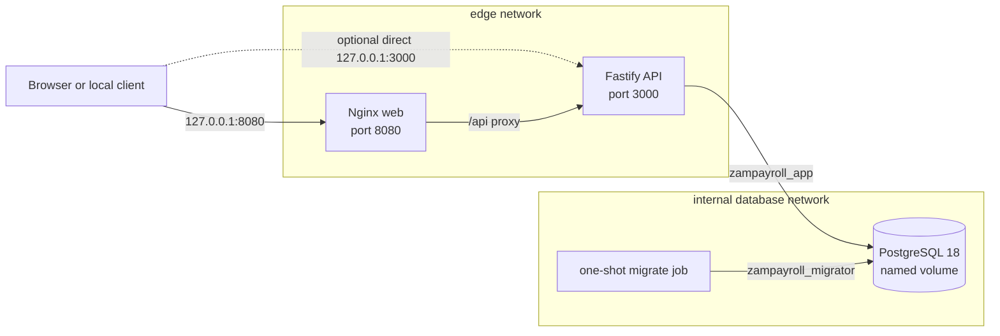

# ZamPayroll Architecture

## Status and scope

This document distinguishes the completed Phase 1 repository foundation and
the current Phase 2 domain work from future payroll architecture. Sections
marked **Future** describe constraints for later phases; they do not claim that
a feature, domain model, statutory rule, or security control has been
implemented.

> [!IMPORTANT]
> There is no payroll engine or statutory calculation. PAYE, NAPSA, NHIMA,
> payslips, employees, authentication, authorized business routes, and
> finalized payroll runs are not implemented. Company and identity records now
> exist only as an internal domain and persistence foundation.

The sequencing and security decisions for Phase 2 are recorded in
[ADR 0001](decisions/0001-phase-2-domain-boundaries.md). Authentication details
are recorded in
[ADR 0002](decisions/0002-authentication-security-foundation.md).

## Current Phase 2 boundary

Phase 2 begins with framework-independent value objects and an immutable
payroll-calculation contract. The contract defines the evidence a future
calculator must receive and return; it is not a calculator implementation.
There are no statutory constants, default rounding behavior, calculate route,
or finalization route.

The current persistence slice adds global user accounts plus company-scoped
companies, memberships, roles, assignments, and permission identifiers. Every
tenant table has forced row-level security. The runtime database adapter sets a
validated company identifier locally inside one transaction; missing context
sees no tenant records, and commit or rollback clears the setting before the
pooled connection can be reused. Global user accounts remain invisible to the
runtime role until the authentication architecture owns their access.

The authentication foundation now provides an Argon2id password-verifier
adapter, an injected password-blocklist contract, independently generated
opaque session and CSRF tokens, immutable authorization principals, and a
bounded audit-event contract that rejects secret-bearing metadata keys.
Credential and server-side session tables have forced RLS and no direct runtime
table privileges. A security-definer function is the only current runtime path
into the append-only audit table and rejects tenant IDs that differ from the
transaction context. These are internal primitives: credential/session access,
cookie delivery, throttling, and authentication routes remain closed.

Business HTTP routes remain closed until server-side authentication, CSRF
protection, current company membership, RBAC, tenant context, and append-only
audit are implemented and tested. Client-provided user or company headers are
not an authentication mechanism and will not be introduced as a temporary
shortcut.

## Current system

ZamPayroll is an npm-workspace repository with two application packages and a
PostgreSQL service:

- `apps/web`: React/Vite presentation shell, built to static files and served
  by an unprivileged Nginx container.
- `apps/api`: a Fastify process containing HTTP, configuration, logging,
  health-check, and database-adapter foundations.
- PostgreSQL: persistent storage with bootstrap, migration, and runtime roles.
- `migrate`: a one-shot API-image target that applies ordered SQL migrations
  before the API starts.

The API is intentionally a modular-monolith foundation. It is one deployable
backend process and one database, with internal boundaries expected to carry
domain ownership later. The repository does not introduce microservices,
message brokers, or distributed transactions.

### Compose topology

The base `database` network is internal and PostgreSQL has no host-published
port. `compose.dev.yaml` attaches PostgreSQL to an additional non-internal
`dev_database` network and publishes its port on `127.0.0.1` for host-only
development. The `edge` network connects only the web and API services.

Host port bindings are loopback-only. TLS termination, ingress, orchestration,
backups, monitoring, and production secret delivery are deployment concerns
that are not provided by this Phase 1 Compose stack.

### Startup and readiness

Current Compose startup is ordered by health and completion conditions:

1. PostgreSQL initializes its data directory and restricted roles.
2. PostgreSQL is healthy only when it accepts an authenticated TCP query and
   both application roles exist.
3. The one-shot migration service applies migrations as
   `zampayroll_migrator`.
4. The API starts only after migrations complete successfully.
5. The web container starts only after the API reports ready.

The health signals have intentionally different meanings:

| Signal                  | Meaning                                                                                                                      |
| ----------------------- | ---------------------------------------------------------------------------------------------------------------------------- |
| `GET /api/health/live`  | The Fastify process can answer a request; no database dependency is checked.                                                 |
| `GET /api/health/ready` | PostgreSQL is reachable, the session is exactly `zampayroll_app`, the `app` schema exists, and that role has schema `USAGE`. |
| `GET /health` on web    | Nginx can answer locally.                                                                                                    |

Readiness returns `503` with a minimal response when the dependency check
fails. Database connection details and errors are not returned to the client.
An idle PostgreSQL client error is converted to a fixed operational log event
so connection details are not deliberately included in that event.

### Database security boundaries

The current roles and schemas separate bootstrap, DDL, and runtime access:

| Identity/schema                              | Current responsibility                                                                                                                                |
| -------------------------------------------- | ----------------------------------------------------------------------------------------------------------------------------------------------------- |
| `POSTGRES_USER` (default `zampayroll_admin`) | Initial cluster/database bootstrap and container health query. It is not used by the API or migration job.                                            |
| `zampayroll_migrator`                        | Login role that owns application DDL, creates migration metadata, and applies version-controlled migrations.                                          |
| `zampayroll_app`                             | Restricted login used by the API and database integration tests. It cannot create schemas, application tables, or temporary tables.                   |
| `app`                                        | Version-controlled application objects. It contains tenant, identity, credential, session, and audit foundations, but no workforce or payroll tables. |
| `zampayroll_internal`                        | Migration-tool metadata. The runtime role cannot access it.                                                                                           |
| `public`                                     | Default public access and schema creation are revoked.                                                                                                |

The migrator's default privileges grant the runtime role table
`SELECT`/`INSERT`/`UPDATE`, sequence `USAGE`/`SELECT`, and function `EXECUTE`
for future objects in `app`. Runtime `DELETE` is revoked. Public function
execution is revoked for future objects. Table grants are still filtered by
forced row-level security policies.

The tenant setting is defense in depth, not proof of authorization. A process
holding the runtime database credential can set a custom PostgreSQL setting,
so future application services must derive the company from a live,
authenticated membership and must never trust a client-selected company ID.
The database policies then limit the impact of application mistakes and reject
cross-tenant references after that application-level decision.

Migrations are timestamped SQL, ordered, transaction-wrapped, and protected by
an advisory lock. The migration identity and runtime identity use separate
connection URLs and passwords.

### Configuration and process boundaries

- `.env.example` documents local inputs; `.env` is ignored by Git.
- The API validates environment values at startup with Zod, including URL,
  enum, numeric-bound, and boolean validation.
- Host and Compose database URLs are separate because their network hostnames
  differ.
- The API pool has bounded size and connection, idle, and statement timeouts.
- Database TLS can be enabled with certificate verification; the local default
  is disabled.
- Fastify applies Helmet, a configured CORS origin, a one-megabyte request-body
  limit, structured logging, generic server-error responses, and graceful
  shutdown.
- Runtime API, migration, and web containers use read-only filesystems,
  unprivileged users, dropped Linux capabilities, and
  `no-new-privileges`. PostgreSQL persists to a named volume.

These controls are a starting baseline. Authentication routes, credential and
session access services, authorization enforcement, application-level tenant
resolution, encryption/key management, application audit integration, backup
recovery, rate limiting, and production deployment policy remain future work.

## Internal modular-monolith direction — Future

Future backend code should remain in one deployable API unless a measured need
justifies another process. Each module should own its application behavior and
domain model while depending on other modules through explicit interfaces.
Presentation and infrastructure code may call domain/application code; domain
code must not depend on HTTP, React, Fastify, PostgreSQL, or Docker.

Candidate future module boundaries are:

| Module                  | Future ownership                                                                                     |
| ----------------------- | ---------------------------------------------------------------------------------------------------- |
| Identity and access     | Users, secure sessions, roles, and company-scoped authorization                                      |
| Company                 | Company profile, payroll settings, and statutory identifiers                                         |
| Workforce               | Employees and employment lifecycle                                                                   |
| Compensation            | Salaries, allowances, and deductions                                                                 |
| Payroll                 | Periods, runs, employee results, calculation orchestration, finalization, corrections, and reversals |
| Statutory configuration | Effective-dated PAYE, NAPSA, and NHIMA rule sets with source metadata                                |
| Documents and reporting | Payslips, statutory schedules, and configurable bank exports                                         |
| Audit                   | Append-oriented records of security-sensitive and payroll-sensitive actions                          |

Cross-module database access should not bypass module invariants. APIs must
validate untrusted inputs, application services must authorize company-scoped
operations, and the database must enforce durable invariants where practical.

## Payroll calculation boundary — Future

The payroll calculation engine will be an isolated, deterministic domain
component. It must not depend on the UI, HTTP requests, wall-clock time,
database connections, or mutable global state.

Conceptually, it will accept employee/employment facts, compensation,
deductions, a payroll period, and an explicitly selected statutory
configuration. It will return a complete calculation breakdown containing
gross pay, taxable income, PAYE, NAPSA, NHIMA, other deductions, net pay, and
applicable employer contributions.

The following constraints apply when this future work begins:

- Money representation, rounding order, and boundary behavior must be explicit
  and tested.
- Statutory configurations must have identifiers, effective date ranges,
  parameters, authoritative source/reference metadata, and tests.
- A calculation must retain the exact configuration version and inputs needed
  to reproduce its result.
- Statutory rates must be verified against authoritative Zambian sources. They
  must never be guessed, copied from an unverified example, or scattered as
  constants across the application.
- Results should be immutable values; persistence and presentation should
  consume them without recalculating them differently.

None of those rules or calculations exists yet.

## Finalization and audit boundary — Future

A finalized payroll run must become immutable. No ordinary update path may
silently rewrite its input, configuration version, breakdown, or totals.
Corrections and reversals must be explicit, separately authorized workflows
that preserve the original result and create an auditable relationship to the
new record.

Application audit integration must capture important company, employee,
configuration,
calculation, finalization, correction, user, and authorization events without
copying unnecessary payroll or authentication secrets into logs. Audit records
must include reliable actor, tenant, event, target, and time context.

The append-only storage and bounded event foundations exist, but no business or
authentication workflow emits audit events yet. Finalized payroll is not
implemented.

## Testing strategy

Current tests cover environment validation, API health behavior, the frontend
foundation, pure domain values, the database adapter, and live PostgreSQL
privileges when `TEST_DATABASE_URL` is supplied. With both test database URLs,
the integration suite also verifies forced RLS, tenant visibility, transaction
context cleanup, composite cross-tenant references, lifecycle/value
constraints, restricted deletes, global-user deny defaults, credential/session
table denial, and tenant-checked audit appends. Security unit tests cover the
password policy contract, Argon2id parameters, opaque tokens, authorization,
and bounded metadata. The root quality gate runs formatting, linting, type
checking, tests, and builds.

Future domain tests must cover zero and low income, normal salaries,
allowances, deductions, statutory and rounding boundaries, configuration
changes, multiple employees, reproducibility, and finalized-run immutability.
API and database tests must accompany validation, authorization, persistence,
and migration work.

## Architectural decision discipline

Keep this document synchronized with implemented architecture. A future claim
becomes a current capability only when code, migrations, authorization, error
handling, tests, security review, and user/developer documentation are all in
place. Significant decisions should record their context, trade-offs, and
consequences rather than relying only on code comments.
